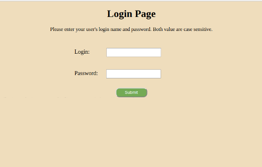
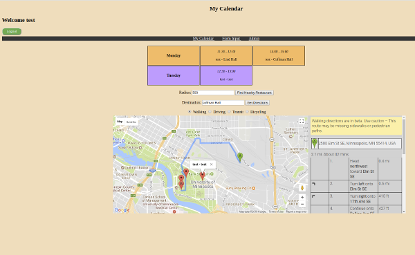
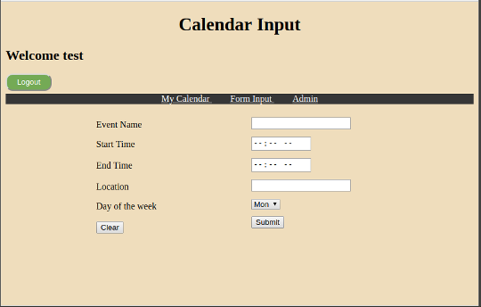
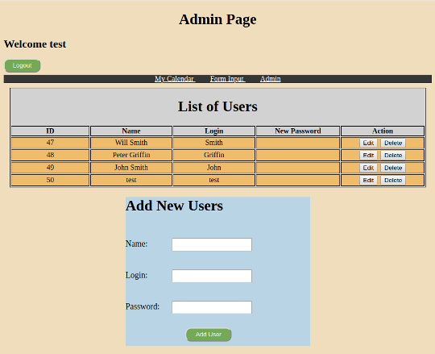

# Calendar-App
Develop a PHP Calendar App that allows you to manage your schedule. It uses Google map API to mark the location of your meeting or schedules. This Web application was design in Model-View-Controller framework.

## Basic functionality
* App has Login Page that allows user to visit their own calendar Page.
* Uses MySql to query the database for both login and admin functionality.
* Has the functionality to Add, Delete and Edit event in the calendar.
* Uses [Google map Api](https://developers.google.com/maps/) to mark down the location for the events.
* Allow to obtain direction from your current position to desired destination.
* Implemented the Admin functionality to support multiple user at once.

### screenshots
Login Page            |  My Calendar Page
:-------------------------:|:-------------------------:
  |  

Add Event Page             |  Admin Page
:-------------------------:|:-------------------------:
  |  
